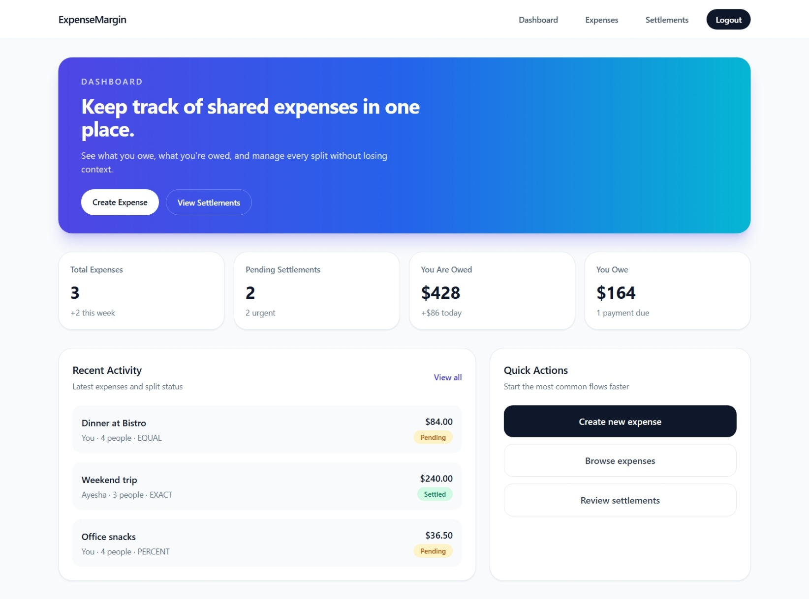
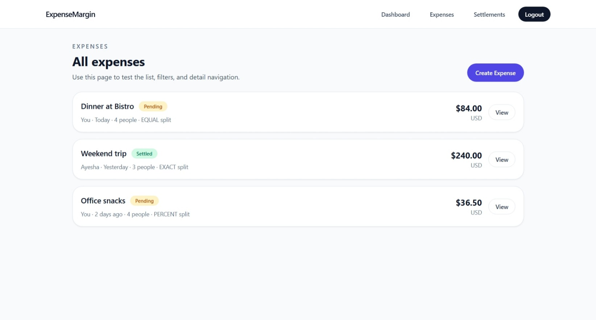
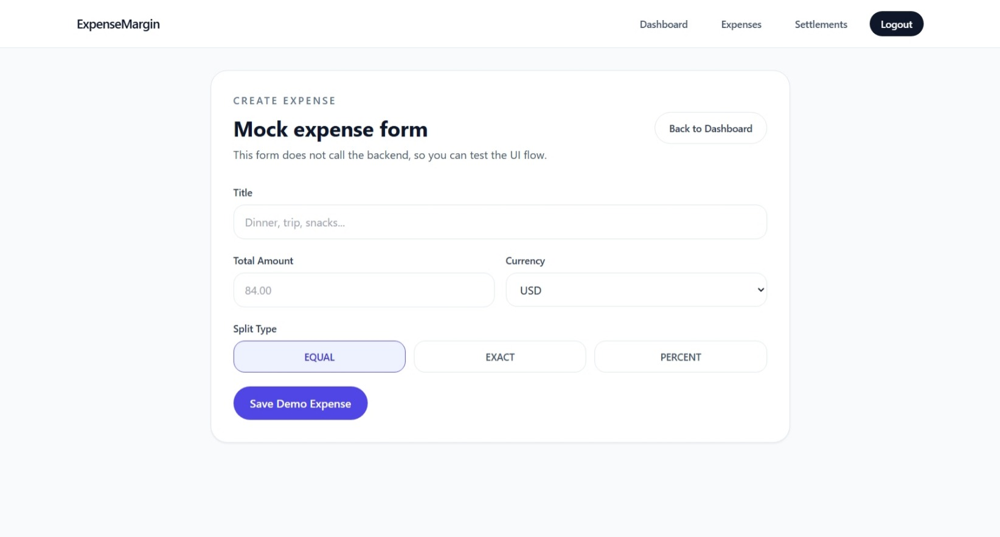
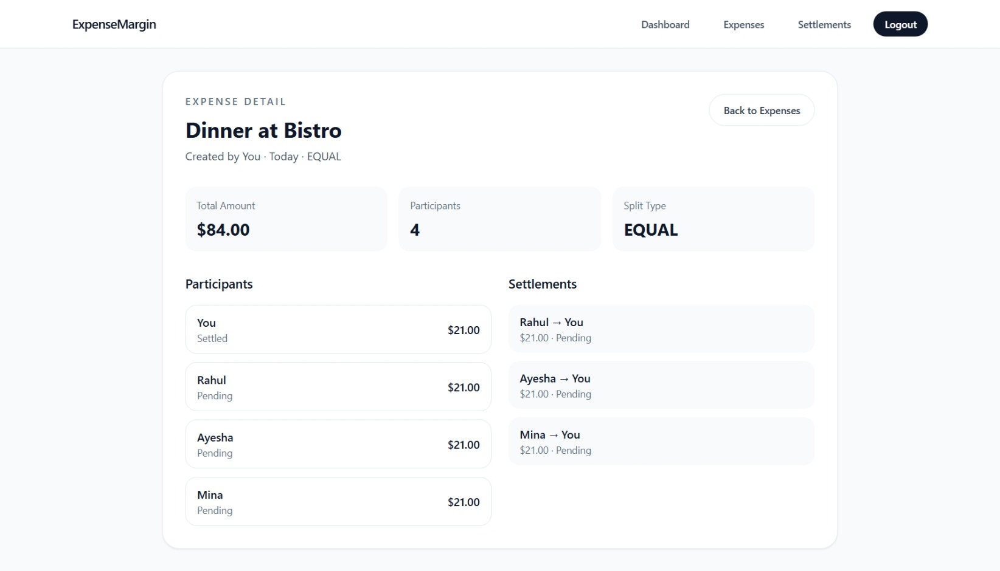
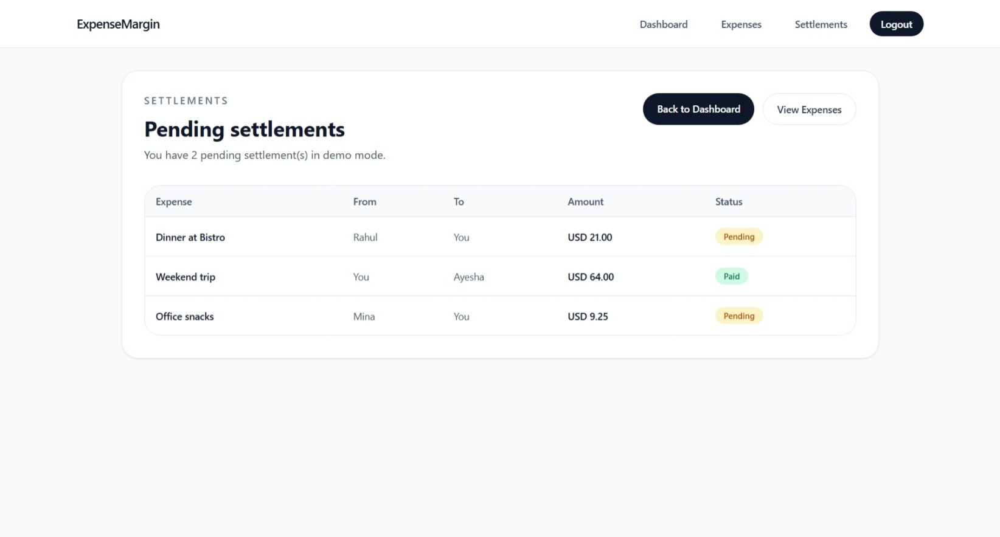

# Expense Margins

Expense Margins is a split-expense and settlement management app built around a microservices backend and a Vue frontend. It helps users create shared expenses, track who owes whom, and keep settlements organized in one place.

## Project Overview

The project is split into two main parts:

- `client/`: a Vue 3 + Vite frontend with Tailwind CSS.
- `server/`: a set of Spring Boot services behind an API Gateway.

The frontend talks to the backend through the gateway, which routes requests to authentication, user, expense, and notification services.

## Core Features

- User signup and login
- Expense creation and split tracking
- Expense list and expense detail views
- Settlement tracking
- Clean responsive UI with Tailwind CSS

## Tech Stack

- Frontend: Vue 3, Vite, TypeScript, Pinia, Vue Router, Tailwind CSS
- Backend: Spring Boot, Spring Cloud Gateway, REST APIs, WebFlux
- Database: PostgreSQL
- Services: Kafka, gRPC

## Screenshots

	

		<strong>Dashboard</strong> 
		
	

	

		<strong>Expense List</strong> 
		
	

	

		<strong>Create Expense</strong> 
		
	

	

		<strong>Expense Detail</strong> 
		
	

	

		<strong>Settlement</strong> 
		
	

